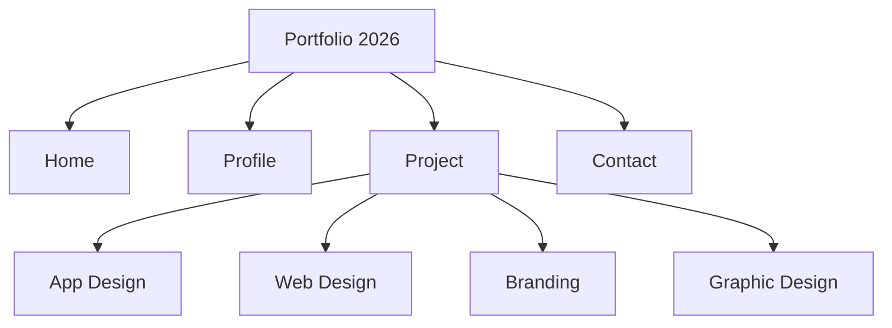
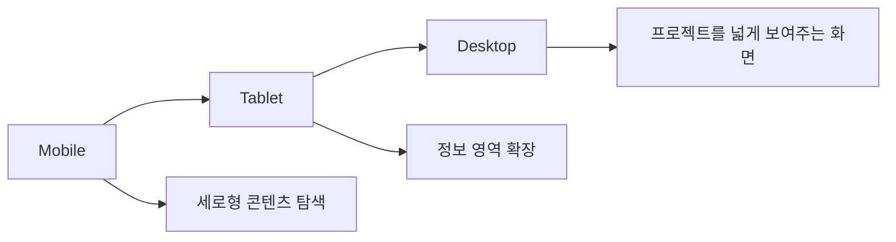
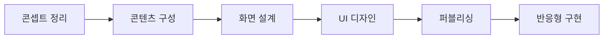

# Portfolio 2026

안녕하세요.  
작은 질문에서 시작한 디자인 고민과 결과물을 담은 포트폴리오 웹사이트입니다.

제가 진행한 앱 디자인, 웹 디자인, 브랜딩, 그래픽 작업을 한곳에서 볼 수 있도록 구성했고,  
각 프로젝트의 분위기와 핵심 내용을 빠르게 파악할 수 있도록 제작했습니다.

 

## 바로가기

| 구분            | 링크                                                                   |
| --------------- | ---------------------------------------------------------------------- |
| 포트폴리오 보기 | [Portfolio 2026 바로가기](https://hyunjaeha.github.io/portfolio-2026/) |

 

## 이 웹사이트를 만든 이유

흩어져 있는 작업물을 단순히 나열하기보다,  
제가 어떤 디자인을 해왔고 어떤 방식으로 문제를 바라보는지 보여주고 싶었습니다.

그래서 프로젝트를 카테고리별로 정리하고,  
사용자가 원하는 작업을 쉽게 찾아볼 수 있도록 섹션 중심으로 구성했습니다.

 

## 사용 기술

 

## 주요 구성

| 섹션    | 내용                                        |
| ------- | ------------------------------------------- |
| Home    | 첫인상과 디자인 콘셉트를 보여주는 메인 화면 |
| Profile | 자기소개, 디자인 방향, 스킬 소개            |
| Project | 앱, 웹, 브랜딩, 그래픽 디자인 작업          |
| Contact | 연락 정보                                   |

 

## 사이트 구조

 

## 작업하면서 신경 쓴 점

| 구분        | 내용                                                                  |
| ----------- | --------------------------------------------------------------------- |
| 정보 구조   | 프로젝트를 카테고리별로 정리해 탐색하기 쉽게 구성                     |
| UI          | 작업물이 돋보이도록 깔끔한 화면과 여백 중심으로 디자인                |
| 반응형      | 모바일, 테블릿, 데스크탑에서 자연스럽게 보이도록 구현                 |
| 인터랙션    | 메뉴 이동과 프로젝트 탐색이 부드럽게 느껴지도록 구성                  |
| 시각적 전달 | 썸네일과 프로젝트 이미지를 활용해 내용을 빠르게 이해할 수 있도록 구성 |

 

## 반응형 구조

 

## 제작 과정

 

## 프로젝트를 통해 보여주고 싶었던 것

이 포트폴리오 웹사이트는 단순히 작업물을 모아둔 페이지가 아니라,  
제가 어떤 방식으로 디자인을 바라보고 결과물을 정리하는지 보여주기 위해 제작했습니다.

작은 궁금증을 그냥 넘기지 않고,  
질문을 더 나은 화면과 사용 경험으로 바꿔가는 과정을 담았습니다.
